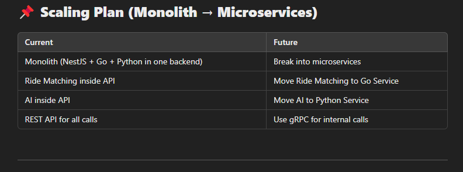

Full architecture guide

# 🚗 Carpool System Architecture Guide

## 📌 Overview  
This document outlines the architecture of a **Carpool System** that integrates:  
- **NestJS (REST API & WebSockets)**
- **Go (High-performance ride matching with gRPC)**
- **Python (AI/ML for route optimization)**
- **PostgreSQL (Database for rides, drivers, payments)**
- **gRPC (For fast internal service communication)**
- **WebSockets (For real-time ride tracking)**

---

## **📌 System Architecture**
### **Hybrid REST + gRPC Architecture**


[Client (Mobile/Web)] <-- REST API --> [NestJS API Gateway] <-- gRPC --> [Go Ride Matching Service] <-- gRPC --> [Python AI Service] ↕ [PostgreSQL DB]


✅ **REST API:** Used for communication between the client (React Native, Flutter, Web) and the backend.  
✅ **gRPC:** Used for high-speed, efficient communication between NestJS, Go, and Python services.  
✅ **WebSockets:** Used for real-time ride tracking.

---

## **📌 Service Breakdown**
| Service | Tech Stack | Purpose |
|---------|-----------|---------|
| **API Gateway** | NestJS + TypeScript | Handles authentication, requests, and payments |
| **Ride Matching** | Go + gRPC + PostgreSQL | Finds the best driver for a passenger |
| **Route Optimization** | Python + TensorFlow | AI-based route and ETA optimization |
| **Notifications** | NestJS + Firebase | Sends SMS, push notifications |
| **Payments** | NestJS + Stripe/PayPal | Processes ride payments |
| **Ride Tracking** | WebSockets (NestJS) | Real-time driver tracking |

---+-+

## **📌 Database Schema (PostgreSQL + TypeORM)**
### **🚖 Rides Table**
```sql
CREATE TABLE rides (
    id SERIAL PRIMARY KEY,
    passenger_name VARCHAR(100),
    driver_id INT,
    origin_lat FLOAT,
    origin_long FLOAT,
    destination_lat FLOAT,
    destination_long FLOAT,
    start_time TIMESTAMP,
    end_time TIMESTAMP,
    distance FLOAT,
    fare FLOAT
);
```

[Client (Mobile/Web)] <-- REST API --> [NestJS API Gateway] <-- gRPC --> [Go Ride Matching Service] <-- gRPC --> [Python AI Service] ↕ [PostgreSQL DB]



🚀 This architecture ensures:
✅ Scalability (Can start as monolith & move to microservices).
✅ Real-time tracking (Using WebSockets).
✅ Optimized performance (Go for matching, Python for AI).
✅ Easy payment integration 