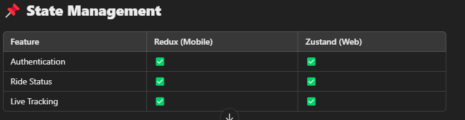

# 🎨 Carpool Frontend Architecture Guide

## 📌 Overview  
This document outlines the frontend architecture for the **Carpool System**.
- **Tech Stack** (React Native for Mobile, Next.js for Web)  
- **State Management** (Redux, Zustand, Context API)  
- **API Calls** (REST for user actions, WebSockets for tracking)  
- **Google Maps Integration** (Live Tracking)  
- **Authentication** (JWT, OAuth)  
- **UI/UX Components** (Material UI, Tailwind, NativeBase)  
- **Deployment Strategy** (Expo, Vercel, Firebase)  

---

## **📌 Tech Stack**
| Platform | Framework | UI Library | State Management | Maps API |
|----------|----------|------------|-----------------|---------|
| **Mobile (Android/iOS)** | React Native (Expo) | NativeBase | Redux Toolkit | Google Maps SDK |
| **Web** | Next.js (React) | Material UI | Zustand | Google Maps JS API |

---

## **📌 Folder Structure**
### **React Native (Mobile)**

/frontend-mobile /src /components --> Reusable UI components (buttons, modals) /screens --> App screens (Home, Ride, Profile) /store --> State management (Redux/Zustand) /services --> API calls (REST & WebSockets) /config --> App configurations (API keys) App.tsx --> Root component


### **Next.js (Web)**

/frontend-web /src /components --> Reusable components (Navbar, Cards) /pages --> Pages (index.tsx, ride.tsx, profile.tsx) /store --> State management (Zustand) /services --> API calls (Axios, WebSockets) /styles --> CSS modules or Tailwind _app.tsx --> Root component


---

## **📌 API Calls (REST + WebSockets)**
### **REST API for General Requests**
- **Login/Register:** `POST /auth/login`, `POST /auth/register`
- **Book a Ride:** `POST /rides/match`
- **Get Ride History:** `GET /rides/{id}/history`
- **Complete a Ride:** `POST /rides/{id}/complete`
- **Make a Payment:** `POST /payments/pay`

### **WebSockets for Real-Time Tracking**
- **Driver sends GPS updates:** `socket.emit("updateLocation", { driverId, lat, long })`
- **Passenger receives updates:** `socket.on("location_1", (data) => {...})`

---

## **📌 Google Maps Integration**
### **React Native (Mobile)**
```tsx
import MapView, { Marker } from "react-native-maps";

export default function RideTracking({ driverLocation }) {
  return (
    <MapView
      style={{ flex: 1 }}
      initialRegion={{
        latitude: driverLocation.lat,
        longitude: driverLocation.long,
        latitudeDelta: 0.05,
        longitudeDelta: 0.05,
      }}
    >
      <Marker coordinate={{ latitude: driverLocation.lat, longitude: driverLocation.long }} title="Driver" />
    </MapView>
  );
}

```




🚀 This frontend architecture ensures:
✅ Scalability (React Native for mobile, Next.js for web)
✅ Real-time updates (WebSockets for ride tracking)
✅ Optimized state management (Redux/Zustand)
✅ Secure authentication (JWT)
✅ Easy payment processing 